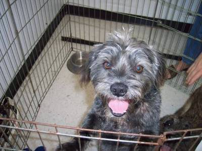
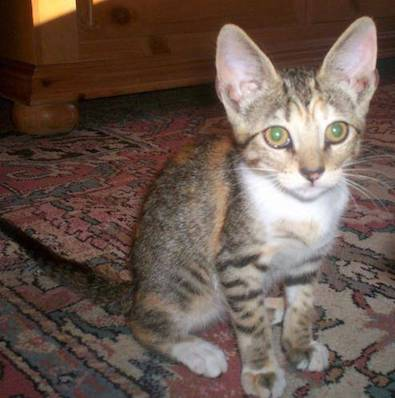
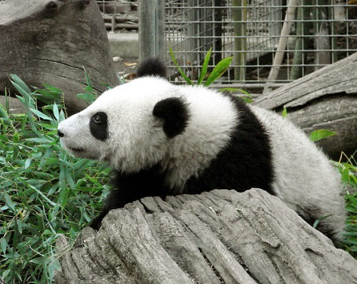

# Transfer Learning

...

## Datasets

### Dogs vs Cats vs Pandas

3,000 images of dogs 🐶 vs cats 🐱 vs pandas 🐼, a 1,000 each

Dog             |  Cat             |  Panda
:-------------------------:|:-------------------------:|:-------------------------:
  |   | 

See [here]() for further details

## Technologies

* [keras](https://keras.io)
* [tensorflow](https://www.tensorflow.org/)
* [scikit-learn](https://scikit-learn.org/)
  
## Deployment

...

### Dogs vs Cats vs Pandas

Extract features:
```
$ python src/extract_features.py --dataset datasets/animals/images --output datasets/animals/hdf5/features.hdf5
[INFO] loading images...
[INFO] loading network...
Downloading data from https://github.com/fchollet/deep-learning-models/releases/download/v0.1/vgg16_weights_tf_dim_ordering_tf_kernels_notop.h5
58892288/58889256 [==============================] - 5s 0us/step
Extracting Features: 100% |############################################################| Time: 0:04:57
```

Train and evaluate the model:
```
$ python src/train_model.py --db datasets/animals/hdf5/features.hdf5 --model models/animals.cpickle
[INFO] tuning hyperparameters...
[INFO] best hyperparameters: {'C': 0.1}
[INFO] evaluating...
              precision    recall  f1-score   support

         cat       0.99      0.98      0.99       251
         dog       0.98      0.98      0.98       250
       panda       1.00      1.00      1.00       249

    accuracy                           0.99       750
   macro avg       0.99      0.99      0.99       750
weighted avg       0.99      0.99      0.99       750

[INFO] saving model...
```

## Resources

* Deep Learning for Computer Vision with Python by Dr. Adrian Rosebrock: https://www.pyimagesearch.com/deep-learning-computer-vision-python-book/