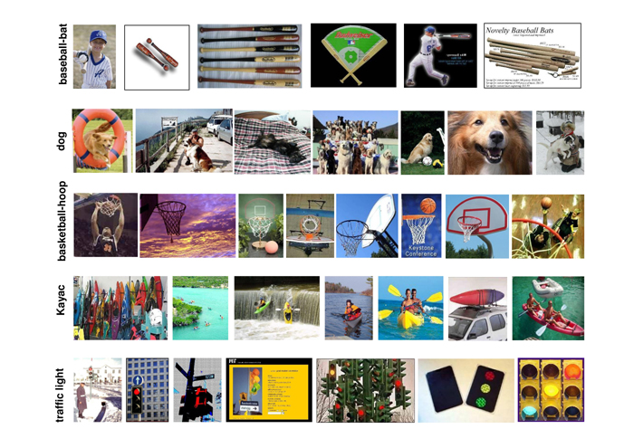

# Transfer Learning: Networks as Feature Extractors

Transfer learning: ability to use a pre-trained model as a "shortcut" to learn patterns from data it was not originally trained on.

There are two types of transfer learning in the context of deep learning:

1. **Transfer learning via feature extraction**: treating networks as arbitrary feature extractors
2. Transfer learning via fine-tuning

This repo will focus on the first method of transfer learning

## Datasets

### Dogs vs Cats vs Pandas

3,000 images of dogs 🐶 vs cats 🐱 vs pandas 🐼, a 1,000 each

Dog             |  Cat             |  Panda
:-------------------------:|:-------------------------:|:-------------------------:
  |   | 

See [this repo](https://github.com/dazcona/dogs-vs-cats-vs-pandas) for further details on the dataset.

### CALTECH-101

Pictures of objects belonging to 101 categories. About 40 to 800 images per category. Most categories have about 50 images. The size of each image is roughly 300 x 200 pixels. [Dataset](http://www.vision.caltech.edu/Image_Datasets/Caltech101/) was collected by the Computational Vision at CalTech.



### Flowers-17

Pictures of 17 category flower dataset with 80 images for each class. [Dataset](http://www.robots.ox.ac.uk/~vgg/data/flowers/17/) was collected by the Visual Geometry Group at the University of Oxford.


## Technologies

* [keras](https://keras.io)
* [tensorflow](https://www.tensorflow.org/)
* [HDF5](https://www.h5py.org/)
* [scikit-learn](https://scikit-learn.org/)
  
## Deployment with Docker

1. Build the docker image:
```
$ cd docker
$ make build
```

2. Create a docker container based on the image:
```
$ make run
```

3. SSH to the docker container:
```
$ make dev
```

### Dogs vs Cats vs Pandas

4. Extract features:
```
$ python src/extract_features.py --dataset datasets/animals/images --output datasets/animals/hdf5/features.hdf5
[INFO] loading images...
[INFO] loading network...
Downloading data from https://github.com/fchollet/deep-learning-models/releases/download/v0.1/vgg16_weights_tf_dim_ordering_tf_kernels_notop.h5
58892288/58889256 [==============================] - 5s 0us/step
Extracting Features: 100% |############################################################| Time: 0:04:57
```

5. Train and evaluate the model:
```
$ python src/train_model.py --db datasets/animals/hdf5/features.hdf5 --model models/animals.cpickle
[INFO] tuning hyperparameters...
[INFO] best hyperparameters: {'C': 0.1}
[INFO] evaluating...
              precision    recall  f1-score   support

         cat       0.99      0.98      0.99       251
         dog       0.98      0.98      0.98       250
       panda       1.00      1.00      1.00       249

    accuracy                           0.99       750
   macro avg       0.99      0.99      0.99       750
weighted avg       0.99      0.99      0.99       750

[INFO] saving model...
```

### CALTECH-101

4. Extract features:
```
$ python src/extract_features.py --dataset datasets/CALTECH-101/images/ --output datasets/CALTECH-101/hdf5/features.hdf5
[INFO] loading images...
[INFO] loading network...
Extracting Features: 100% |############################################################| Time: 0:14:12
```

5. Train and evaluate the model:
```
$ python src/train_model.py --db datasets/CALTECH-101/hdf5/features.hdf5 --model models/CALTECH-101.cpickle
[INFO] best hyperparameters: {'C': 0.1}
[INFO] evaluating...
                 precision    recall  f1-score   support

          Faces       0.98      0.99      0.99       121
     Faces_easy       0.99      0.98      0.99       107
       Leopards       1.00      1.00      1.00        57
     Motorbikes       0.99      1.00      0.99       178
      accordion       0.93      1.00      0.96        13
      airplanes       0.99      1.00      0.99       194
         anchor       0.90      0.75      0.82        12
            ant       0.80      0.89      0.84         9
         barrel       1.00      1.00      1.00         8
           bass       0.93      0.81      0.87        16
         beaver       1.00      0.75      0.86        12
      binocular       0.78      1.00      0.88         7
         bonsai       0.90      1.00      0.95        27
          brain       0.94      0.97      0.96        33
   brontosaurus       0.94      0.88      0.91        17
         buddha       0.95      1.00      0.97        19
      butterfly       0.97      0.97      0.97        30
         camera       1.00      1.00      1.00        17
         cannon       1.00      0.92      0.96        12
       car_side       1.00      1.00      1.00        23
    ceiling_fan       0.83      0.91      0.87        11
      cellphone       1.00      1.00      1.00        18
          chair       0.87      0.93      0.90        14
     chandelier       0.96      1.00      0.98        22
    cougar_body       1.00      0.75      0.86        16
    cougar_face       0.94      1.00      0.97        16
           crab       0.95      0.91      0.93        23
       crayfish       0.72      0.87      0.79        15
      crocodile       0.71      1.00      0.83        10
 crocodile_head       1.00      0.93      0.96        14
            cup       1.00      1.00      1.00        11
      dalmatian       1.00      1.00      1.00        19
    dollar_bill       0.92      1.00      0.96        12
        dolphin       0.82      1.00      0.90        14
      dragonfly       1.00      1.00      1.00        21
electric_guitar       0.95      1.00      0.97        19
       elephant       0.82      0.90      0.86        10
            emu       1.00      0.92      0.96        13
      euphonium       1.00      1.00      1.00        18
           ewer       1.00      1.00      1.00        25
          ferry       1.00      1.00      1.00        18
       flamingo       0.92      1.00      0.96        11
  flamingo_head       0.92      1.00      0.96        12
       garfield       1.00      1.00      1.00         8
        gerenuk       1.00      1.00      1.00         7
     gramophone       0.93      1.00      0.97        14
    grand_piano       1.00      1.00      1.00        28
      hawksbill       0.96      1.00      0.98        24
      headphone       1.00      0.92      0.96        13
       hedgehog       0.93      1.00      0.97        14
     helicopter       0.89      1.00      0.94        16
           ibis       1.00      0.92      0.96        24
   inline_skate       1.00      1.00      1.00         4
    joshua_tree       0.89      0.94      0.91        17
       kangaroo       0.95      0.95      0.95        21
          ketch       0.86      0.89      0.87        35
           lamp       0.83      0.94      0.88        16
         laptop       1.00      1.00      1.00        18
          llama       0.77      0.83      0.80        12
        lobster       1.00      0.46      0.63        13
          lotus       0.50      0.89      0.64         9
       mandolin       1.00      0.92      0.96        12
         mayfly       1.00      0.90      0.95        10
        menorah       1.00      1.00      1.00        19
      metronome       1.00      0.92      0.96        13
        minaret       1.00      1.00      1.00        18
       nautilus       0.92      0.92      0.92        13
        octopus       0.67      0.67      0.67         6
          okapi       1.00      0.90      0.95        10
         pagoda       0.94      1.00      0.97        15
          panda       1.00      1.00      1.00        10
         pigeon       1.00      0.92      0.96        12
          pizza       0.93      0.93      0.93        15
       platypus       0.80      0.50      0.62         8
        pyramid       1.00      0.96      0.98        27
       revolver       1.00      0.95      0.98        22
          rhino       1.00      1.00      1.00        14
        rooster       1.00      0.92      0.96        12
      saxophone       1.00      1.00      1.00        12
       schooner       0.79      0.75      0.77        20
       scissors       0.88      1.00      0.93         7
       scorpion       0.96      1.00      0.98        22
      sea_horse       0.92      0.92      0.92        12
         snoopy       0.90      0.82      0.86        11
    soccer_ball       1.00      1.00      1.00        13
        stapler       1.00      1.00      1.00        11
       starfish       1.00      0.95      0.98        22
    stegosaurus       0.90      0.90      0.90        10
      stop_sign       1.00      1.00      1.00        14
     strawberry       1.00      1.00      1.00        11
      sunflower       1.00      0.96      0.98        27
           tick       0.91      0.91      0.91        11
      trilobite       1.00      1.00      1.00        21
       umbrella       1.00      0.90      0.95        20
          watch       1.00      0.98      0.99        52
    water_lilly       0.67      0.22      0.33         9
     wheelchair       1.00      0.87      0.93        15
       wild_cat       0.78      1.00      0.88         7
  windsor_chair       1.00      0.86      0.92        14
         wrench       0.90      0.90      0.90        10
       yin_yang       0.88      0.88      0.88        16

       accuracy                           0.96      2170
      macro avg       0.94      0.93      0.93      2170
   weighted avg       0.96      0.96      0.95      2170

[INFO] saving model...
```

### Flowers-17

4. Extract features:
```
$ python src/extract_features.py --dataset datasets/Flowers-17/images/ --output datasets/Flowers-17/hdf5/features.hdf5
[INFO] loading images...
[INFO] loading network...
Extracting Features: 100% |##################################################################################################################################################################| Time: 0:02:16
```

5. Train and evaluate the model:
```
$ python src/train_model.py --db datasets/Flowers-17/hdf5/features.hdf5 --model models/Flowers-17.cpickle
[INFO] tuning hyperparameters...
[INFO] best hyperparameters: {'C': 0.1}
[INFO] evaluating...
                precision    recall  f1-score   support

    1 Daffodil       0.95      0.78      0.86        23
  10 Sunflower       1.00      1.00      1.00        23
      11 Daisy       1.00      1.00      1.00        18
  12Colts Foot       1.00      1.00      1.00        18
13 Dandelalion       1.00      1.00      1.00        15
    14 Cowslip       0.67      0.86      0.75        21
  15 Buttercup       0.78      1.00      0.88        18
 16 Windflower       0.90      0.86      0.88        22
      17 Pansy       0.96      0.89      0.93        28
    2 Snowdrop       0.70      1.00      0.82        14
 3 Lily Valley       1.00      0.93      0.96        27
    4 Bluebell       0.90      1.00      0.95        19
      5 Crocus       0.93      0.81      0.87        16
        6 Iris       1.00      0.89      0.94        19
   7 Tigerlily       1.00      0.93      0.97        15
        8Tulip       0.96      0.79      0.86        28
  9 Fritillary       1.00      1.00      1.00        16

      accuracy                           0.92       340
     macro avg       0.93      0.93      0.92       340
  weighted avg       0.93      0.92      0.92       340

[INFO] saving model...
```

## Resources

* Deep Learning for Computer Vision with Python by Dr. Adrian Rosebrock: https://www.pyimagesearch.com/deep-learning-computer-vision-python-book/
